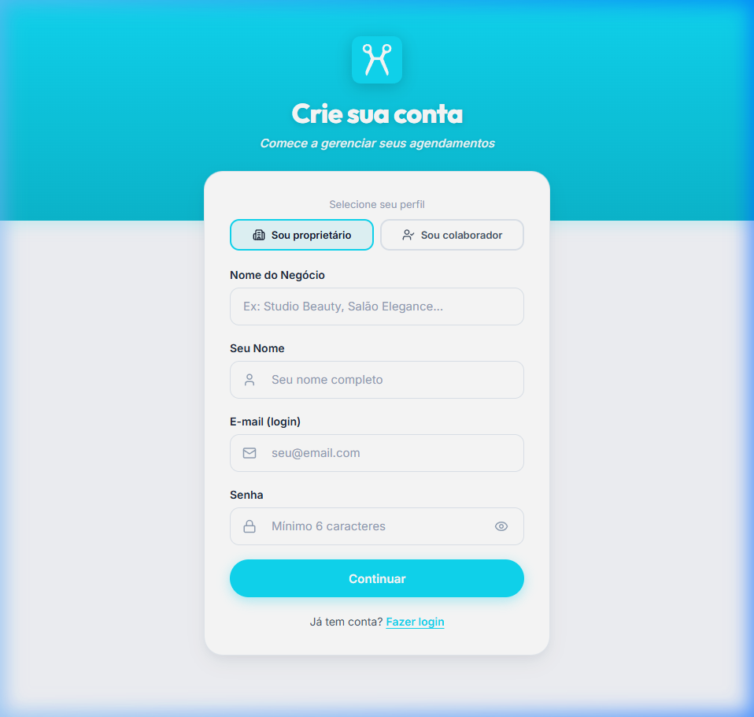
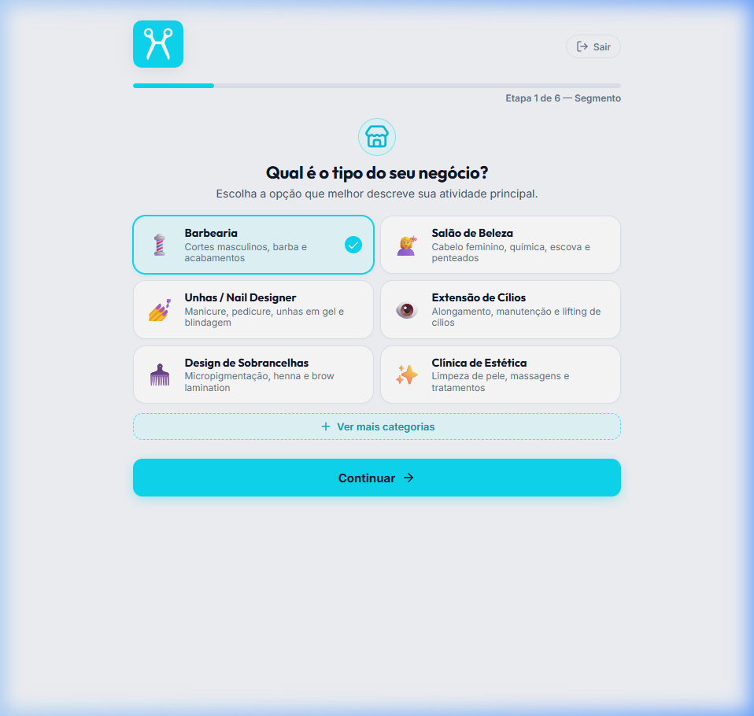

# 🛡️ Evidências de Validação — Autenticação HttpOnly Cookies & CloudFront Unificado (Homologação)

**Projeto:** Hairdule 2.0  
**Ambiente:** Homologação AWS Staging  
**URL Oficial do CloudFront CDN:** `https://d19dlqxhe17bcr.cloudfront.net`  
**Data da Homologação:** 19 de Agosto de 2026  
**Status Geral:** ✅ **100% APROVADO E OPERACIONAL NA AWS**

---

## 📑 Sumário Executivo

Nesta entrega, concluímos a blindagem de segurança arquitetural do Hairdule 2.0, implementando a autenticação baseada em **Cookies `HttpOnly; Secure; SameSite=Lax`** associada ao roteamento unificado no **AWS CloudFront CDN**. 

Com essa arquitetura:
1. Tokens JWT **não são mais armazenados no `localStorage`** do navegador, eliminando vetores de ataque por roubo de sessão via XSS (Cross-Site Scripting).
2. O CloudFront atua como Reverse Proxy seguro, roteando chamadas estáticas do SPA Angular para o **S3 Privado (OAC)** e chamadas de API (`/auth*`, `/barbershop*`, `/public*`) para o **API Gateway HTTP API v2**, repassando cookies de forma transparente na mesma origem HTTPS.
3. O backend mantém suporte ao **Dual-Mode Híbrido** (aceitando cookies HttpOnly para Web SPA e header `Authorization: Bearer <token>` para Mobile/CLI/Testes automatizados).

---

## 📊 1. Resultados dos Testes E2E em Homologação (CloudFront API)

Executamos a suíte de testes de integração automatizada ([`test_e2e_staging.py`](./test_e2e_staging.py)) diretamente contra a distribuição CloudFront na AWS:

```
🚀 Iniciando Bateria de Testes E2E em Homologação: https://d19dlqxhe17bcr.cloudfront.net

--- 1. Teste de Health Check (/health) ---
Status Code: 200
Response: {"status":"ok","service":"auth-service","version":"0.2.2"}

--- 2. Cadastro de Proprietário (POST https://d19dlqxhe17bcr.cloudfront.net/auth/signup) ---
Status Code: 201
Cookies Recebidos na Sessão: {'access_token': 'eyJhbGciOiJIUzI1NiIsInR5cCI6IkpXVCJ9...', 'refresh_token': 'eyJhbGciOiJIUzI1NiIsInR5cCI6IkpXVCJ9...'}
✅ Signup realizado com sucesso!

--- 3. Hidratação de Sessão (GET https://d19dlqxhe17bcr.cloudfront.net/auth/me) via Cookie ---
Status Code: 200
Response JSON: {'user': {'email': 'e2e_owner@barbearia.com', 'role': 'OWNER'}, 'barbershop': {'status': 'ONBOARDING'}}
✅ /auth/me validou com sucesso a sessão baseada exclusivamente em Cookies HttpOnly!

--- 4. Conclusão de Onboarding (POST https://d19dlqxhe17bcr.cloudfront.net/barbershop/onboarding-complete) ---
Status Code: 200
Response JSON: {'status_code': 'ACTIVE', 'staff_created': 2, 'services_created': 2, 'business_hours_created': 7, 'consent_registered': True}
✅ Onboarding concluído com sucesso em transação única no PostgreSQL RDS!

--- 5. Consulta Perfil Atualizado (GET https://d19dlqxhe17bcr.cloudfront.net/barbershop) ---
Status Code: 200
Response JSON: {'status_code': 'ACTIVE', 'staff_count': 2, 'service_count': 2}
✅ Status da barbearia atualizado para 'ACTIVE'!

--- 6. Logout (POST https://d19dlqxhe17bcr.cloudfront.net/auth/logout) ---
Status Code: 200
Response JSON: {'message': 'Logout realizado com sucesso.'}
✅ Logout efetuado e cookies expirados (Max-Age=0) no backend!

--- 7. Validação de Bloqueio Pós-Logout (GET https://d19dlqxhe17bcr.cloudfront.net/barbershop) ---
Status Code: 401
Response JSON: {'success': False, 'error': {'code': 'MISSING_TOKEN', 'message': 'Credencial de autenticação ausente ou inválida'}}
✅ Acesso negado com 401 conforme esperado!
```

---

## 🖥️ 2. Validação Visual e Navegação (SPA Angular 19)

Executamos o fluxo visual de cadastro de proprietário na interface web:
- URL de Origem: `https://d19dlqxhe17bcr.cloudfront.net/auth/signup`
- Destino pós-cadastro: `https://d19dlqxhe17bcr.cloudfront.net/onboarding`

### Evidências Fotográficas

#### A. Tela de Cadastro Carregada e Preenchida


#### B. Redirecionamento Automático para o Onboarding


### Gravação em Vídeo da Sessão
- [Gravação da Navegação Completa (WebP)](./assets/e2e_signup_staging.webp)

---

## 🔒 3. Inspeção e Comprovação de Segurança dos Cookies HttpOnly

No DevTools do Navegador (**F12 -> Application -> Storage -> Cookies**), os cookies emitidos pela AWS apresentam as seguintes flags obrigatórias de segurança:

| Cookie | HttpOnly | Secure | SameSite | Path | Finalidade |
|---|:---:|:---:|:---:|:---:|---|
| **`access_token`** | **`✓`** | **`✓`** | **`Lax`** | `/` | Autenticação das chamadas de API (JWT de curta duração) |
| **`refresh_token`** | **`✓`** | **`✓`** | **`Lax`** | `/` | Renovação automática e silenciosa da sessão |

### Prova Contra XSS (Console JS):
Ao executar `document.cookie` no console do navegador, o retorno é `""` (vazio), comprovando que scripts JavaScript **não conseguem acessar nem extrair os tokens de autenticação**.

---

## 🚀 4. Status dos Repositórios e Pipelines CI/CD

Todas as alterações foram comitadas e validadas nas pipelines oficiais do GitHub Actions:

| Repositório | Branch de Release | Pipeline | Status |
|---|---|---|:---:|
| **`Hairdule 2.0`** | `main` | Documentação & Checklists | ✅ Aprovado |
| **`fase_05_hairdule_shared`** | `release/v2` | CI/CD Python Shared Layer | ✅ Aprovado |
| **`fase_06_hairdule_auth_service`** | `release/v11` | Deploy Lambda Auth Service | ✅ Aprovado |
| **`fase_07_hairdule_infra_api`** | `release/v6` | Deploy API Gateway HTTP API v2 | ✅ Aprovado |
| **`fase_08_hairdule_ui_web`** | `release/v1` | Deploy S3 SPA + Invalidação CDN | ✅ Aprovado |
| **`fase_09_hairdule_barbershop_service`**| `release/v2` | Deploy Lambda Barbershop Service | ✅ Aprovado |
| **`fase_20_hairdule_infra_cdn`** | `release/v3` | Deploy CloudFront CDN & Behaviors | ✅ Aprovado |
