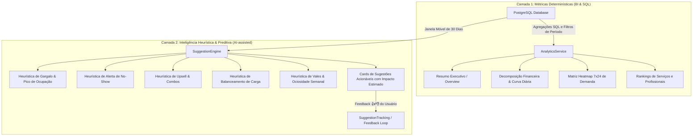

# 📊 Hairdule 2.0 — Motor Analítico, Business Intelligence & Heurísticas Preditivas

Este documento detalha o funcionamento, as fórmulas matemáticas e as regras heurísticas do módulo analítico (**Fase 26 — `fase_26_hairdule_analytics_service`**) e sua apresentação no frontend (**Fase 08 — `fase_08_hairdule_ui_web`**).

---

## 1. Visão Geral da Arquitetura Analítica

O sistema opera com um modelo analítico híbrido de duas camadas:



---

## 2. Camada 1: Métricas Determinísticas (BI em Tempo Real)

Todas as métricas são calculadas dinamicamente com base no período selecionado (**Hoje**, **Esta Semana**, **Este Mês** ou **Intervalo Personalizado**), alinhadas ao fuso horário de Brasília (`America/Sao_Paulo`):

### 2.1. Faturamento Total (`total_revenue_cents`)
* **Regra de Negócio:** Considera exclusivamente agendamentos concluídos (`status_code == 'FINALIZADO'`).
* **Fórmula:**
  $$\text{Faturamento} = \sum_{i \in \text{Finalizados}} \text{price\_cents}_i$$
* **Finalidade:** Garante que apenas receita efetivamente realizada entre no balanço financeiro, evitando distorções com agendamentos futuros ou cancelados.

### 2.2. Total de Agendamentos & Concluídos
* **Total de Agendamentos:** Contagem de todos os agendamentos registrados no período (independentemente do status: `AGENDADO`, `CONFIRMADO`, `EM_ATENDIMENTO`, `FINALIZADO`, `CANCELADO`, `NAO_COMPARECEU`).
* **Atendimentos Concluídos:** Contagem de agendamentos com status `FINALIZADO`.

### 2.3. Ticket Médio (`average_ticket_cents`)
* **Fórmula:**
  $$\text{Ticket Médio} = \frac{\text{Faturamento Total}}{\text{Atendimentos Concluídos}}$$
* **Interpretação:** Representa o gasto médio de cada cliente por visita realizada no estabelecimento.

### 2.4. Taxa de No-Show (`no_show_rate_percent`)
* **Fórmula:**
  $$\text{Taxa de No-Show} = \left( \frac{\text{Agendamentos com status 'NAO\_COMPARECEU'}}{\text{Total de Agendamentos}} \right) \times 100$$
* **Interpretação:** Mede a perda de produtividade decorrente de clientes que agendaram horário mas não compareceram nem avisaram previamente.

### 2.5. Taxa de Ocupação (`occupancy_rate_percent`)
* **Fórmula:**
  $$\text{Taxa de Ocupação} = \left( \frac{\sum \text{duration\_min dos Atendimentos Concluídos}}{\text{Capacidade Operacional Instalada (minutos)}} \right) \times 100$$
* **Capacidade Operacional:** Calculada multiplicando os minutos de trabalho configurados na barbearia pela quantidade de profissionais ativos no período.

### 2.6. Comparativo Temporal vs. Período Anterior
Para cada métrica, o sistema calcula o intervalo equivalente anterior (ex: Mês Atual vs. Mês Anterior) e exibe o crescimento percentual:
$$\Delta\% = \left( \frac{\text{Valor Atual} - \text{Valor Anterior}}{\text{Valor Anterior}} \right) \times 100$$

### 2.7. Matriz Heatmap 7x24 de Demanda
* Um mapa de calor bidimensional que cruza os **7 dias da semana** (Domingo a Sábado) com as **24 horas do dia** (0h às 23h).
* Identifica visualmente onde estão concentrados os horários mais nobres e as faixas horárias ociosas.

---

## 3. Camada 2: Inteligência Heurística do Sistema

O motor heurístico (`SuggestionEngine`) atua como um **consultor de negócios digital**. Ele analisa os últimos **30 dias de histórico real** da barbearia e dispara regras de decisão diagnósticas:

---

### Heurística 1: Pico de Ocupação e Gargalo de Capacidade
* **Objetivo:** Detectar momentos críticos em que a demanda supera a capacidade de atendimento, gerando perda de faturamento ou atrasos.
* **Gatilho Heurístico:**
  1. O motor mapeia todos os agendamentos em pares `(dia_da_semana, hora)`.
  2. Se um determinado horário acumular **4 ou mais agendamentos no mês** (o que equivale a praticamente 1 cliente por semana no mesmo horário exato):
* **Ação Gerada:**
  - **Título:** `Pico de Ocupação: {Dia}s às {Hora}:00`
  - **Prioridade:** `Alta Prioridade` (Borda Vermelha)
  - **Diagnóstico:** Identifica alta concentração de clientes e recomenda abrir horários extras ou escalar mais colaboradores.
  - **Impacto Estimado:** Absorção de até 25% mais clientes sem gerar fila de espera.

---

### Heurística 2: Desbalanceamento de Carga entre Profissionais
* **Objetivo:** Identificar assimetrias operacionais onde um profissional está sobrecarregado enquanto outro está ocioso.
* **Gatilho Heurístico:**
  1. A barbearia precisa ter pelo menos 2 profissionais ativos.
  2. O motor calcula o volume de agendamentos atribuído a cada um.
  3. Se o profissional mais demandado tiver **3 vezes mais atendimentos** que o menos demandado, e acumular no mínimo **6 agendamentos**:
* **Ação Gerada:**
  - **Título:** `Balanceamento de Agenda: {Profissional A} vs {Profissional B}`
  - **Prioridade:** `Baixa` ou `Média` (Borda Azul)
  - **Diagnóstico:** O profissional A concentrou X agendamentos enquanto o profissional B teve apenas Y. Recomenda ajustar a ordem de disponibilidade no portal de agendamento ou divulgar o portfólio do novo colaborador.
  - **Impacto Estimado:** Distribuição homogênea da equipe e redução da fadiga operacional.

---

### Heurística 3: Dia de Baixo Movimento (Ociosidade Semanal)
* **Objetivo:** Localizar vales de faturamento ao longo da semana para incentivar estratégias de ocupação.
* **Gatilho Heurístico:**
  1. O motor soma o volume de clientes atendidos em cada um dos 7 dias da semana.
  2. Se o dia com menor movimento tiver **menos de 40% da média diária dos outros dias** (e a média geral for $\ge 2$ atendimentos):
* **Ação Gerada:**
  - **Título:** `Dia de Baixo Movimento: {Dia}s`
  - **Prioridade:** `Média Prioridade` (Borda Amarela/Laranja)
  - **Diagnóstico:** Aponta o dia específico com menor movimentação frente à média e sugere benefícios, cupons ou descontos de fidelidade exclusivos para esse dia.
  - **Impacto Estimado:** Preenchimento de horários ociosos com receita incremental.

---

### Heurística 4: Alerta e Mitigação de No-Show (Faltas)
* **Objetivo:** Combater o absenteísmo de clientes que reservam horários e deixam cadeiras vazias.
* **Gatilho Heurístico:**
  1. O motor calcula o percentual de faltas nos últimos 30 dias.
  2. Se a taxa de no-show ultrapassar **10%** (se $> 15\%$, torna-se `Alta Prioridade`):
* **Ação Gerada:**
  - **Título:** `Atenção à Taxa de No-Show ({Taxa}%)`
  - **Prioridade:** `Média` ou `Alta`
  - **Diagnóstico:** Indica a quantidade exata de ausências e sugere ativação de lembretes automáticos de 15 minutos via Web Push/E-mail ou confirmação prévia.
  - **Impacto Estimado:** Redução comprovada de até 60% nas ausências de clientes.

---

### Heurística 5: Engenharia de Menu & Combos de Alto Ticket
* **Objetivo:** Elevar o ticket médio aproveitando a popularidade dos serviços mais vendidos.
* **Gatilho Heurístico:**
  1. Identifica o serviço com **maior volume de saídas** (ex: *Corte Clássico*).
  2. Identifica o serviço com **maior valor monetário** (ex: *Barba Terapia* ou *Tratamento Capilar*).
  3. Se forem serviços distintos e o ticket do serviço mais nobre for pelo menos **20% superior** ao popular:
* **Ação Gerada:**
  - **Título:** `Promova Combos: '{Serviço de Alto Valor}'`
  - **Prioridade:** `Média`
  - **Diagnóstico:** Compara a diferença de preço e recomenda criar um combo promocional unindo ambos.
  - **Impacto Estimado:** Elevação estimada de até R$ X,XX por agendamento.

---

### Heurística 0: Cold Start / Onboarding para Barbearias Recém-Criadas
* **Objetivo:** Evitar telas vazias para contas que acabaram de ser criadas e ainda possuem pouco histórico.
* **Gatilho Heurístico:**
  - Se a barbearia tiver **menos de 5 agendamentos** nos últimos 30 dias:
* **Ação Gerada:**
  - **Título:** `Divulgue seu Link Público de Agendamento`
  - **Prioridade:** `Alta Prioridade`
  - **Diagnóstico:** Orienta o proprietário a divulgar o link do portal em canais como Instagram, WhatsApp e Google Meu Negócio para iniciar a captura de reservas.
  - **Impacto Estimado:** Aumento de até 40% no volume de novos clientes nas primeiras semanas.

---

## 4. Loop de Feedback e Aprendizado Humano (RLHF Local)

Cada card de sugestão heurística possui botões interativos de feedback:
- 👍 **Sim (Útil)**
- 👎 **Não (Não útil)**

Ao clicar, o frontend envia uma requisição para:
```http
POST /analytics/suggestions/{suggestion_id}/feedback
Content-Type: application/json

{
  "useful": true,
  "comments": "Aplicamos a sugestão e melhorou o movimento da quinta-feira."
}
```

Os dados são armazenados na tabela `suggestion_tracking` do banco de dados para calibração contínua dos limiares de sensibilidade das heurísticas, permitindo que o sistema aprenda com as preferências reais dos donos de barbearia.
