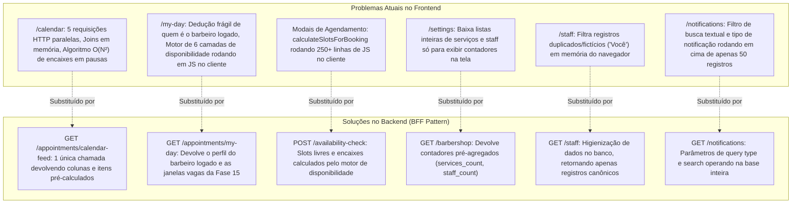

# 🏛️ Plano Mestre de Reestruturação Arquitetural: Frontend "Dumb UI / Pure View" & Abstração no Backend

> **Projeto:** Hairdule 2.0 — Plataforma SaaS de Agendamentos e Gestão de Barbearias  
> **Arquitetura:** AWS Serverless (FastAPI Lambda + Aurora PostgreSQL + Angular 19 SPA)  
> **Status:** Proposta Arquitetural & Checklist de Execução  
> **Data:** 2026-09-02  
> **Diretriz Fundamental:** **Frontend é "Dumb UI / Pure View"**.  
> O frontend nunca deve ser um orquestrador de microsserviços, executor de joins em memória ou calculadora de regras de negócio. O frontend é puramente um reflexo estético, reativo e fluido dos dados entregues prontos pelo Backend.  
> **Regra de Execução:** Nenhuma caixa de seleção (`- [ ]`) deve ser marcada (`- [x]`) sem a aprovação prévia e explícita do usuário para cada ponto concluído.

---

## 1. O Manifesto: Frontend "Dumb UI / Pure View"

Para manter a aplicação escalável, com manutenção simples e velocidade instantânea no mobile, estabelecemos 5 leis arquiteturais para o Hairdule:

1. **Zero Joins no Cliente:**  
   O frontend nunca mais deve cruzar coleções (`staffList.find(s => s.id === item.staff_id)` ou `servicesMap.get(id)`). Se uma tela precisa de agendamentos com nomes de colaboradores e serviços, o backend deve entregar esses dados aninhados e resolvidos via banco de dados (`joinedload`).

2. **Zero Cálculos de Regras de Negócio no Cliente:**  
   O frontend não deve calcular se há sobreposição de horário, se um atendimento é um "encaixe dentro de pausa", quais são os limites dinâmicos de abertura/fechamento do salão ou quais são os horários livres de um colaborador. Toda regra de negócio é processada no servidor.

3. **Chamada Única por Visão (Single-Call Views):**  
   Ao carregar ou trocar a data de uma tela principal (como a Agenda ou Meu Dia), o frontend dispara **uma única requisição HTTP consolidada**. O backend orquestra as tabelas do PostgreSQL em uma única transação e devolve a visão completa pronta para renderização.

4. **Resolução de Identidade no Servidor:**  
   O frontend não deve adivinhar qual colaborador é o usuário logado comparando emails, IDs ou roles. O backend decodifica o token JWT, localiza o registro `staff` correspondente no banco e devolve `my_staff_id` e permissões mastigadas.

5. **A Única Responsabilidade do Frontend:**  
   - Gerenciar o estado visual (Signals e UI State).
   - Renderizar layouts responsivos com glassmorphism, tipografia moderna e micro-animações.
   - Formatar visualmente datas e moedas no padrão local (`pt-BR`).
   - Capturar intenções do usuário (cliques, arrastes, preenchimento de formulários) e enviar comandos ao backend.

---

## 2. Mapa Geral de Diagnóstico: Oportunidades Encontradas

A varredura completa identificou 6 áreas críticas de refatoração no frontend:

---

## 3. Fases do Plano de Implementação

### 🌟 FASE 1 — O Coração da Agenda: Endpoint Consolidado `/calendar/feed` (Prioridade Máxima)
* **Microsserviço de Agendamentos (`fase_17_hairdule_appointment_service`):**
  - Implementar o método `AppointmentService.get_calendar_feed(date, mode, staff_id, current_user_id)`.
  - Consultar em lote no PostgreSQL com `joinedload` de `Appointment`, `Staff`, `Service`, `Customer`, `BusinessHours` e `AvailabilityBlock`.
  - Calcular no servidor:
    1. Horário de funcionamento do salão para o dia (`start_hour`, `end_hour`, `timeline_hours`).
    2. Horários de fora de expediente (`OFF_HOURS`) antes e depois do expediente de cada colaborador.
    3. Intervalos de almoço (`LUNCH_BREAK`) e bloqueios (`UNAVAILABILITY_BLOCK`).
    4. Agendamentos (`APPOINTMENT`) já com dados completos de serviço, cliente e flag `is_fit_in: true` (se for encaixe na pausa de outro atendimento).
    5. Identificador do colaborador logado (`my_staff_id`).
  - Expor rotas: `GET /appointments/calendar-feed` e `GET /appointments?view=calendar_feed`.
* **Frontend Web (`fase_08_hairdule_ui_web`):**
  - Criar `calendar-feed.models.ts` com os DTOs do feed.
  - Substituir as 5 chamadas no `calendar.component.ts` por `appointmentService.getCalendarFeed()`.
  - Remover `reEnrichSelectedAppointment`, `salonGridConfig` computado e busca de `myStaffId` no front.
  - Limpar `timeline-calculator.util.ts`: eliminar o algoritmo de detecção de encaixe `fitInMap` e os blocos de fora de expediente sintetizados no cliente. Manter apenas o cálculo estético de `top` e `height` em pixels.

---

### 🌟 FASE 2 — Meu Dia Inteligente: Endpoint `/appointments/my-day`
* **Microsserviço de Agendamentos (`fase_17_hairdule_appointment_service`):**
  - Implementar `GET /appointments/my-day?date=...&scope=MINE|TEAM`.
  - Resolver a sessão JWT para o colaborador correto no PostgreSQL (`Staff.user_id == current_user.user_id`).
  - Integrar com o motor da `fase_15_hairdule_availability_engine` para retornar as janelas vagas (`open_windows`) calculadas no backend.
  - Retornar agendamentos ativos e finalizados já separados e ordenados.
* **Frontend Web (`fase_08_hairdule_ui_web`):**
  - Refatorar `my-day.component.ts` para consumir a rota consolidada.
  - Remover do frontend a função `availabilityService.calculateOpenTimeWindows` e os loops de matching de emails e IDs de usuário.

---

### 🌟 FASE 3 — Agendamento nos Modais: Consumo do Motor de Disponibilidade
* **Microsserviço de Disponibilidade (`fase_15_hairdule_availability_engine`):**
  - Garantir que o endpoint `POST /availability-check` ou `GET /public/availability` retorne a lista de horários calculados com as 6 camadas (incluindo marcação de encaixes dentro de pausas).
* **Frontend Web (`fase_08_hairdule_ui_web`):**
  - Substituir o método `calculateSlotsForBooking` em `availability.service.ts` por uma chamada direta ao backend ao selecionar data e serviço.
  - O modal apenas exibe os chips retornados pelo servidor.

---

### 🌟 FASE 4 — Higienização e Otimização de Metadados (`Settings`, `Staff` & `Notifications`)
* **Barbershop Service (`fase_09_hairdule_barbershop_service`):**
  - Adicionar contadores agregados (`services_count`, `staff_count`) na resposta de `GET /barbershop`.
* **Staff Service (`fase_11_hairdule_staff_service`):**
  - Higienizar a listagem para nunca retornar registros redundantes ou fantasmas (eliminando a necessidade do filtro de `"Você"` no front).
* **Notification Service (`fase_24_hairdule_notification_service`):**
  - Suportar parâmetros `type` e `search` no endpoint `GET /notifications` para busca paginada real no banco.
* **Frontend Web (`fase_08_hairdule_ui_web`):**
  - Limpar `settings.component.ts`: parar de baixar listas inteiras de serviços e membros apenas para exibir a contagem.
  - Limpar `staff.component.ts`: remover o método `cleanStaffList`.
  - Ajustar `notifications.component.ts` para repassar filtros de busca ao backend.

---

## 4. Cronograma e Checklist de Execução por Fases

### Etapa 1: Reestruturação do Calendário (Fase 1 do Plano Mestre)
- [x] **1.1** Criar DTOs Pydantic de resposta do feed em `fase_17_hairdule_appointment_service/src/schemas/appointment.py`.
- [x] **1.2** Implementar a lógica de agregação e resolução de encaixes em `fase_17_hairdule_appointment_service/src/services/appointment_service.py`.
- [x] **1.3** Expor as rotas em `fase_17_hairdule_appointment_service/src/routes/appointments.py`.
- [x] **1.4** Criar testes unitários em `fase_17_hairdule_appointment_service/tests/test_appointment_service.py` e validar 100% verde.
- [x] **1.5** Adicionar rota explícita `GET /appointments/calendar-feed` em `fase_07_hairdule_infra_api/sst.config.ts`.
- [x] **1.6** Criar modelos no frontend `fase_08_hairdule_ui_web/src/app/core/models/calendar-feed.models.ts`.
- [x] **1.7** Refatorar `calendar.component.ts` e `timeline-calculator.util.ts` no frontend, eliminando os 5 endpoints e os joins manuais.
- [x] **1.8** Executar testes automatizados headless e build de produção no Angular.
- [ ] **1.9** Fazer commit, push na branch `release/v1` e homologar na AWS.

### Etapa 2: Reestruturação da Tela Meu Dia (Fase 2 do Plano Mestre)
- [x] **2.1** Implementar endpoint consolidado em `fase_17_hairdule_appointment_service` com integração de disponibilidade.
- [x] **2.2** Refatorar `my-day.component.ts` no frontend para modelo "Dumb UI".
- [x] **2.3** Validar testes e build de produção.

### Etapa 3: Modais e Disponibilidade (Fase 3 do Plano Mestre)
- [x] **3.1** Conectar modais de agendamento ao motor da Fase 15.
- [x] **3.2** Abstrair a geração de slots para a API do Availability Engine.
- [x] **3.3** Validar testes e build de produção.

### Etapa 4: Higienização de Metadados (Fase 4 do Plano Mestre)
- [x] **4.1** Incluir contadores agregados em `fase_09_hairdule_barbershop_service`.
- [x] **4.2** Simplificar tela de configurações (`settings.component.ts`).
- [x] **4.3** Higienizar listagem de profissionais e busca de notificações.
- [x] **4.4** Validar testes e build de produção.
