# Agendamento

No hairdule antigo o fluxo é o seguinte:

## 1 - Escolher o serviço a ser realizado
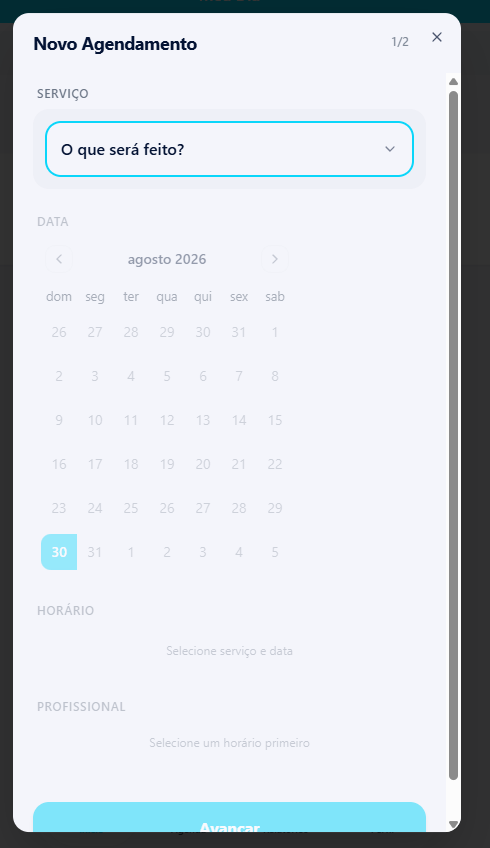

## 2 - É exibido o periodo e o valor padrão, mas cliente pode configurar o periodo e o valor de forma individual para cada serviço, além de dizer se terá pausa ou não.
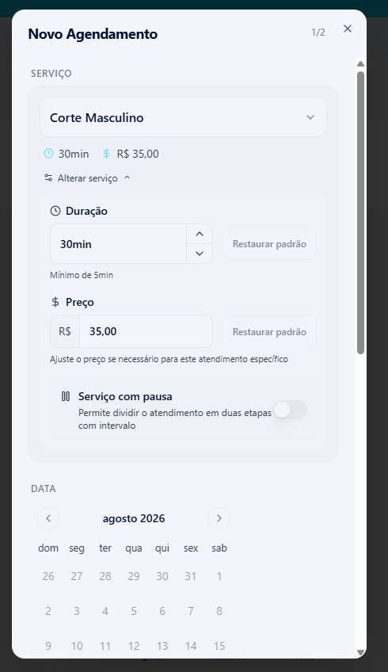

## 3 - Definir a data que o serviço será efetuado
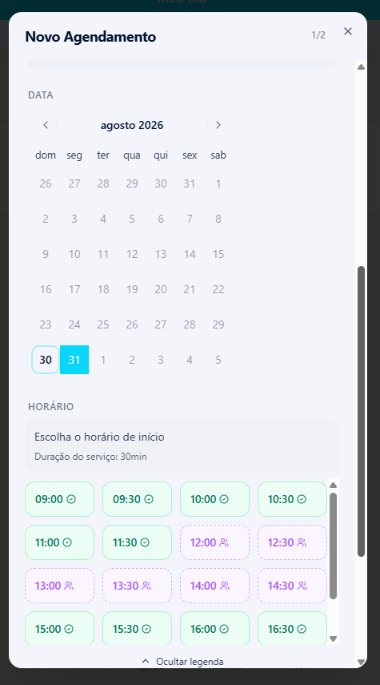

## 4 - Ao escolher a data, o sistema calcula o horário baseado no horário de funcionamento, o tempo de cada serviço e as pausas. E mostra quais os profissionais disponíveis.
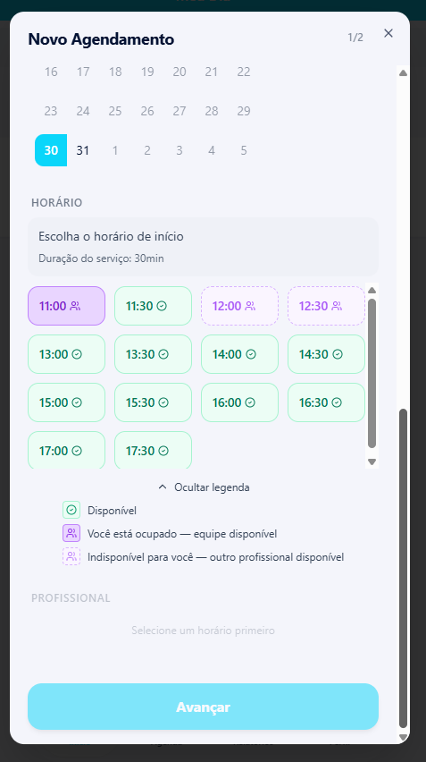

## 5 - Ao final tem o profissional que poderá efetuar a tarefa.
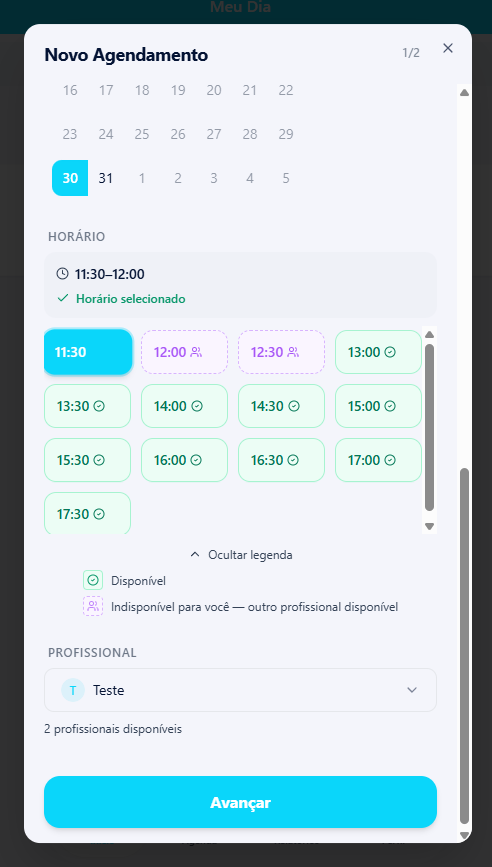

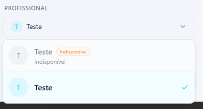

Perceba que a etapa anterior desbloqueia a próxima.

## 7 - Ao avançar é exibido um resumo e o profissional pode colocar os dados do cliente, além de adicionar um novo serviço no mesmo agendamento.

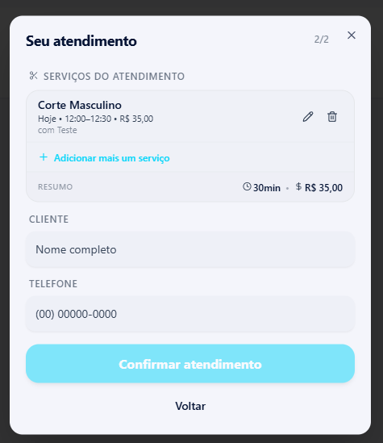

## 8 - Em Disponibilidade é exibidos TODOS os horários disponiveis no dia de uma forma mais rápida, sem precisar pensar muito.

 

Obs: Hairy é o mascote e inteligência do Hairdule:

## 9 - Ao clicar em qualquer horário da disponibilidade, com base nos horários ocupados ele mostra os serviços disponiveis para aquele horário

## 10 - Ao clicar em avançar, é exibido o resumo
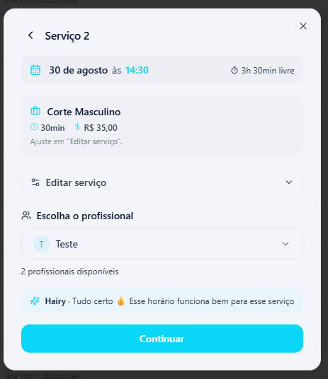

## 11 - Ao continuar é preciso colocar os dados do Cliente.
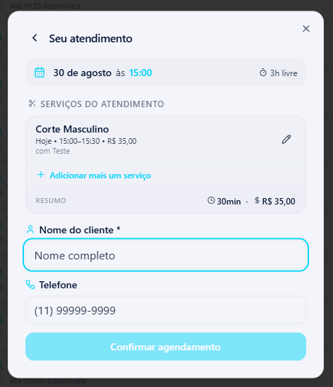

Obs: todo cliente já cadastrado aparece como um combobox na tela. Facilitando ao profissional se ele tiver pelo menos 1 atendimento já feito.

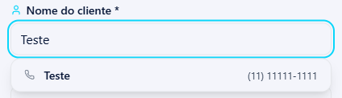

## 12 - Ao clicar no nome exibido é preenchido o nome e telefone automaticamente.

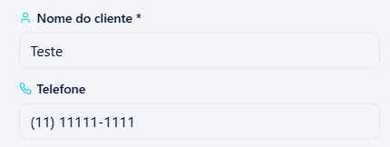