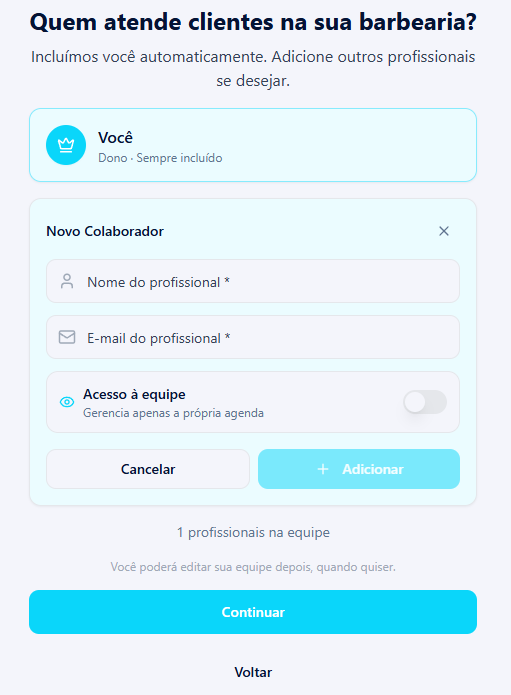
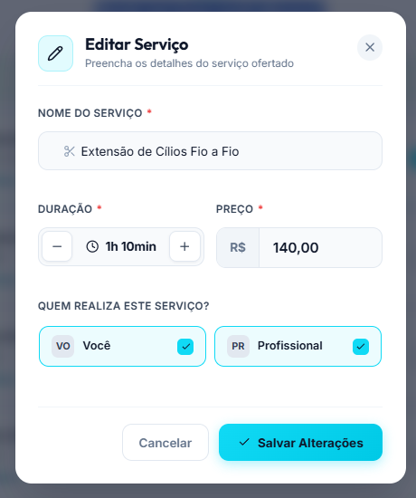
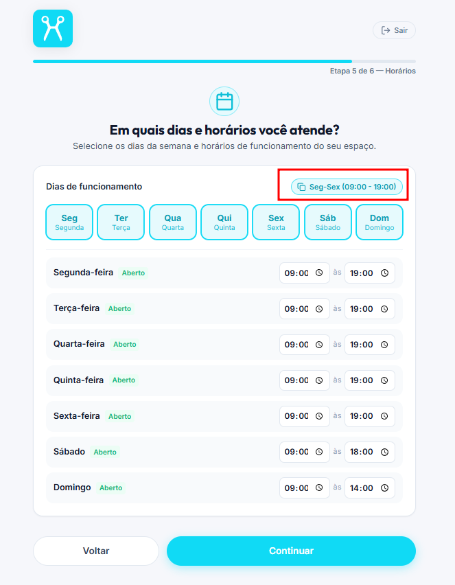
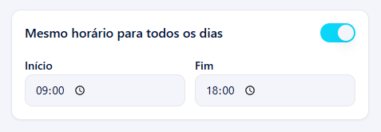
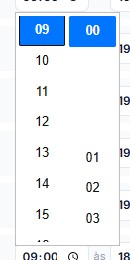

# Mudanças no Cadastro

## 1 - Remover a etapa de endereço no cadastro. O endereço será colocado posteriormente nas configurações.

## 2 - Na etapa "Quem atende clientes?", caso o proprietário inclua um novo profissionar, deixar apenas no formulário o nome e email como obrigatórios, como na versão antiga do Hairdule. Também inclua a opção check de acesso a equipe para cada profissional cadastrado nesta etapa.. 

### Versão atual

### versão antiga

## 3 - Em "Quais serviços você oferece?" pode deixar o botão de + e - juntos e a hora do lado direito: 1h 10min [- | +]

### Também deixe os profissionais um embaixo do outro em vez um do lado do outro

## 4 - Em quais dias e horários você atende?

### O botão de cópiar horário para todos os dias não é claro

### exemplo com o check

### Ao mudar o horário, aparece um vão entre os numeros, uma área branca.
