# Base de clientes
Vamos criar uma página de clientes, onde será possível ver todos os clientes que já foram atendidos pelo salão. Nessa página, devemos ter uma página de detalhes do cliente, onde será possível ver todas as informações do cliente, como nome, telefone, email, data de nascimento e alguma observação. Nessa página de detalhes do cliente, também deve ser possível ver o histórico de atendimentos do cliente, com data, hora e serviços realizados.

# Modo online

O modo online permite o cliente agendar serviços no salão de forma automática.
No Hairdule primeira versão o fluxo segue da seguinte forma:

## 0 - Compartilhar link de agendamento.
Na página inicial, ao clicar no botão "+", aparece a opção de compartilhar link de agendamento ou novo agendamento. Ao clicar em compartilhar link de agendamento, aparece a área de compartilhamento onde o usuário pode enviar o link via WhatsApp, Telegram ou copiar o link. O compartilhamento deve ser feito pelo sistema operacional.

Exemplo da URL: https://cliente.hairdule.com.br/303551db-20ba-4766-9601-ffe05380186e

Onde o UUID é o código único do salão.

## 1 - Página pública de agendamento.
Nessa página, o cliente pode ver a Imagem do salão, caso cadastrado, o endereço e o telefone WhatsApp que é clicável e abre o WhatsApp direto na conversa com o salão.

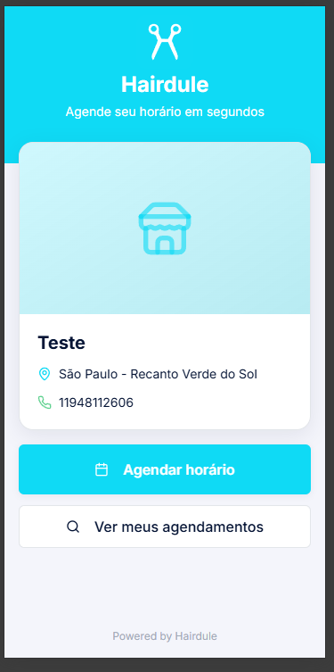

## 2 - Agendar horário
Ao clicar em agendar horário, abre a tela de agendamento onde o cliente pode ver os serviços disponíveis.

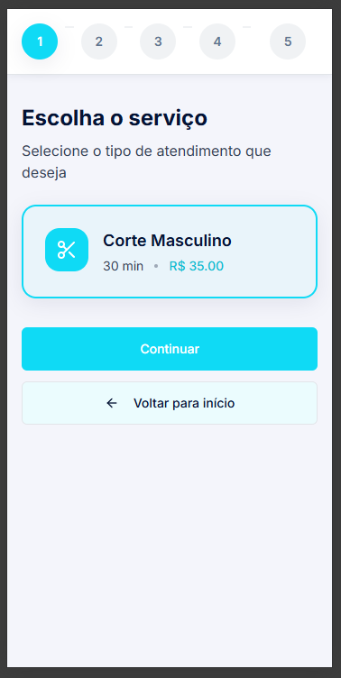

## 3 - Escolha o profissional
Exibe todos os profissionais que prestam o serviço. O cliente pode selecionar o profissional ou deixar em "Qualquer profissional".
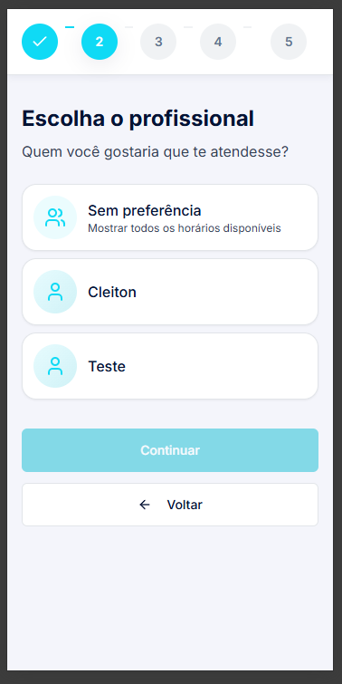

## 4 - Escolha do dia e horário
Vai mostrar o dia e o horário, com base na agenda do profissional selecionado. Caso o cliente não selecionou um profissional, o sistema deve calcular a agenda automaticamente com base na agenda de todos os profissionais que prestam o serviço. Se mais de um profissional prestar o serviço e tiver disponibilidade, o sistema deve calcular a seleção automática com base na quantidade de agendamentos dos profissionais para tentar equilibra ou em caso de empate, de forma aleatória.

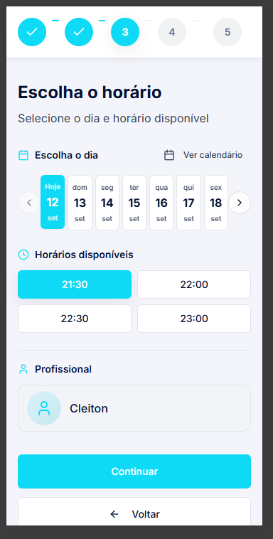

## 5 -  identificação para o atendimento

O usuário deve preencher seus dados. Nome, email e telefone são obrigatórios. Email para cancelameto e reagendamento.

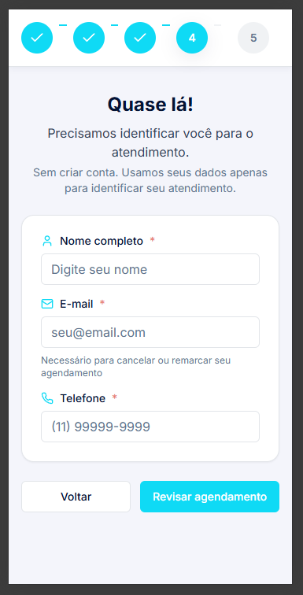

## 6 - Revisão do agendamento

Exibe todas as informações antes de finalizar

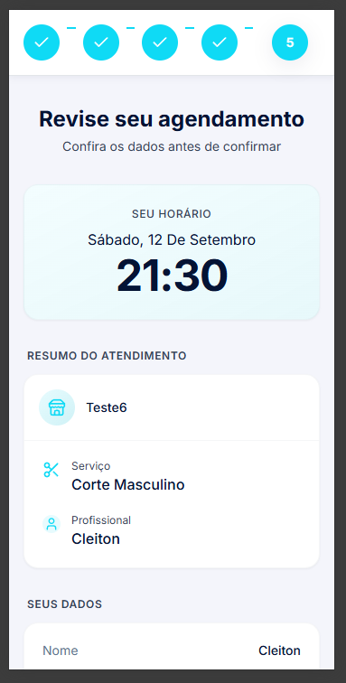

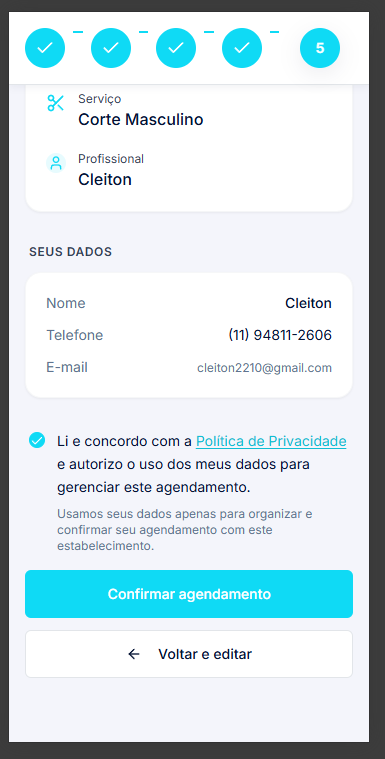

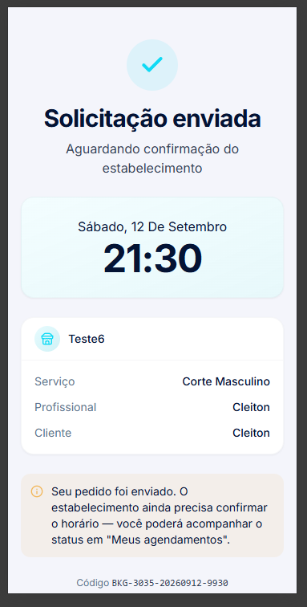

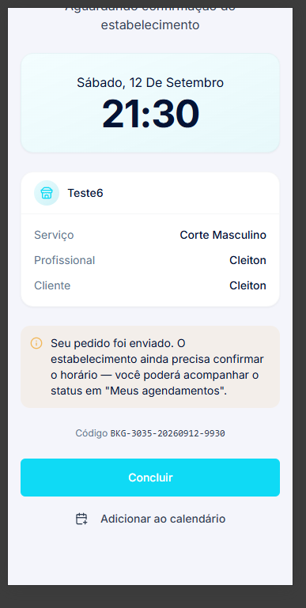

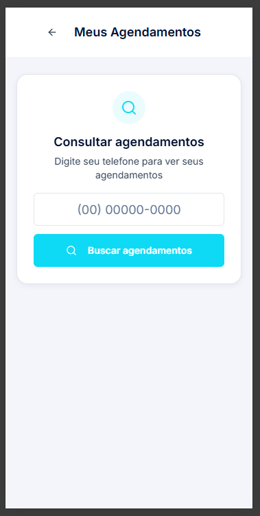

## 7 - Consulta de agendamento
Ao concluir volta a página inicial onde o usuário pode acessar o seu agendamento pesquisnado pelo seu número de telefone.

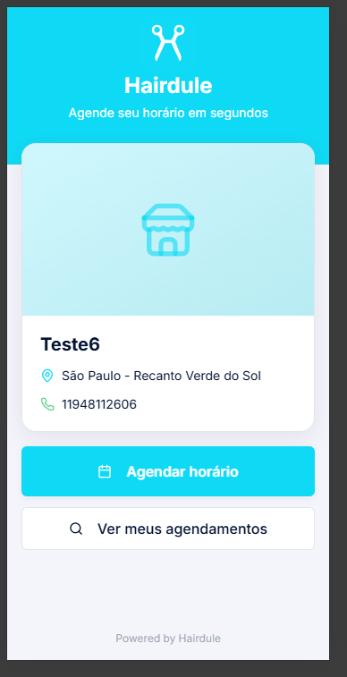

## Ele pode acompanhar se o seu agendamento foi aprovado pelo salão.
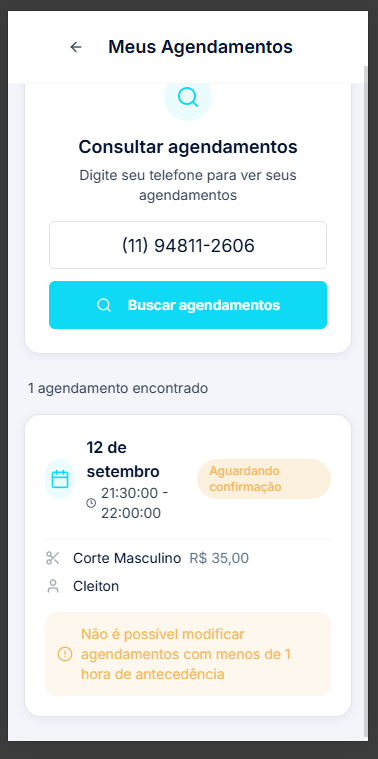

## Política de Privacidade

>Quais dados coletamos
Apenas o necessário para o seu agendamento: nome, telefone, e-mail (quando informado), serviço, profissional e horário.

>Para que usamos
Para organizar, confirmar e gerenciar seu agendamento — incluindo lembretes, cancelamentos e reagendamentos.

>Com quem compartilhamos
Apenas com o estabelecimento responsável pelo atendimento. Não vendemos nem repassamos dados para marketing de terceiros.

>Por quanto tempo guardamos
Pelo tempo necessário para a operação e cumprimento de obrigações legais. Após isso, são excluídos ou anonimizados.

>Seus direitos
Você pode solicitar a qualquer momento acesso, alteração ou exclusão dos seus dados com o estabelecimento ou pelo nosso contato oficial.

>Segurança
Aplicamos medidas técnicas e organizacionais para proteger seus dados contra acesso não autorizado, perda ou uso indevido.