# ⚙️ Configurações e Gestão — Especificação de Telas e Modais

> **Referência Visual:** Telas legadas do Hairdule (`https://app.hairdule.com.br/settings`)  
> **Objetivo:** Mapeamento completo do Hub de Configurações, Dados do Estabelecimento, Endereço e Gestão Unificada de Colaboradores (Serviços, Permissões e Bloqueios de Agenda).

---

## 📱 1. Página Principal de Configurações (`/settings`)

A tela centraliza os dados do perfil, informações da empresa, atalhos de gestão, preferências e configurações de conta.

### Visão Superior (Perfil, Empresa & Gestão)
- **Header do Perfil:** Exibe avatar com iniciais/foto, nome do estabelecimento/usuário e e-mail logado.
- **Seção EMPRESA:**
  - **Dados Cadastrais:** Abre o modal de Informações Básicas do Negócio (*Nome Fantasia, Razão Social, CNPJ, WhatsApp, E-mail, Logo*).
  - **Endereço:** Abre o modal de Local de Atendimento (*CEP, Rua, Nº, Complemento, Bairro, Cidade, UF*).
- **Seção GESTÃO:**
  - **Colaboradores:** Abre o modal central de equipe com contagem do plano (*Horários, Serviços, Férias, Permissões*).
  - **Serviços:** Redireciona para o catálogo de serviços (`/services`).
  - **Horários de Funcionamento:** Redireciona para a configuração de horários gerais (`/availability`).
  - **Clientes:** Redireciona para o gerenciamento de clientes.
- **Barra de Navegação Inferior (Bottom Nav):** Início (`/dashboard`), Agenda (`/calendar`), Relatórios (`/analytics`), Perfil/Configurações (`/settings`).

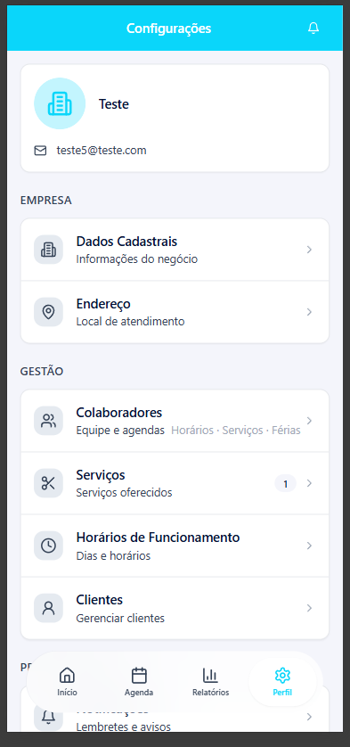

### Visão Inferior (Preferências, Funcionalidades, Suporte & Conta)
- **Seção PREFERÊNCIAS:**
  - **Notificações:** Atalho para a central de alertas e avisos (`/notifications`).
- **Seção FUNCIONALIDADES:**
  - **Modo de Agendamento:** Controle do fluxo de agendamento (*Automático online / Controle manual*).
- **Seção SUPORTE:**
  - **Ajuda e Suporte:** Canal direto de suporte com a equipe Hairdule (WhatsApp / Help Desk).
- **Seção CONTA:**
  - **Meu Plano:** Exibe status da assinatura (ex: *Período gratuito · 14 dias restantes*) e atalho para upgrade/faturamento.
  - **Excluir Conta:** Fluxo com confirmação de segurança para exclusão permanente do estabelecimento e dados.
  - **Botão "Sair da Conta":** Logout seguro com limpeza de sessão/cookies HttpOnly.
  - **Versão do Sistema:** Indicador de versão no rodapé (ex: `Hairdule v1.2.1`).

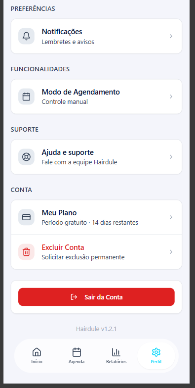

---

## 🏢 2. Modal: Dados do Estabelecimento

Modal para edição do perfil institucional da empresa.

### Campos e Regras:
1. **Foto/Logo:** Upload de imagem (JPEG, PNG ou WebP, máximo 5MB).
2. **Nome Fantasia\*** *(Obrigatório, min 2 caracteres)*.
3. **Razão Social** *(Opcional)*.
4. **CNPJ** *(Opcional, com máscara `00.000.000/0000-00` e validação de formato)*.
5. **WhatsApp** *(Com máscara `(00) 00000-0000`)*.
6. **E-mail de Contato** *(Validação de formato de e-mail)*.
7. **Ações:** Botão `Salvar Alterações` (dispara `PUT /barbershop`) e `Voltar` (fecha modal).

| Topo do Modal (Logo & Nome) | Campos Cadastrais (CNPJ & Contato) |
|---|---|
| 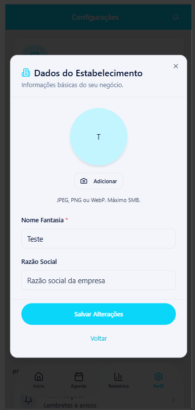 | 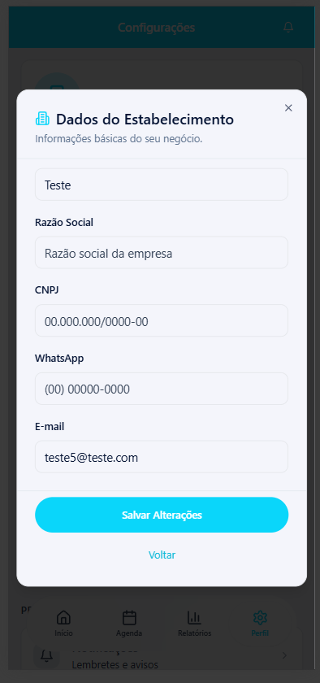 |

---

## 📍 3. Modal: Endereço do Estabelecimento

Modal dedicado para configuração do endereço físico de atendimento.

### Campos e Regras:
1. **CEP** *(Com máscara `00000-000` e botão de lupa para autocompletar via ViaCEP)*.
2. **Rua** *(Preenchido automaticamente pelo CEP ou editável)*.
3. **Nº** *(Número do local)*.
4. **Complemento** *(Apto, sala, bloco, etc. — opcional)*.
5. **Bairro** *(Preenchido automaticamente pelo CEP)*.
6. **Cidade** *(Preenchido automaticamente pelo CEP)*.
7. **UF** *(Select dropdown com estados brasileiros)*.
8. **Ações:** Botão `Salvar Endereço` (dispara `PUT /barbershop`) e `Voltar`.

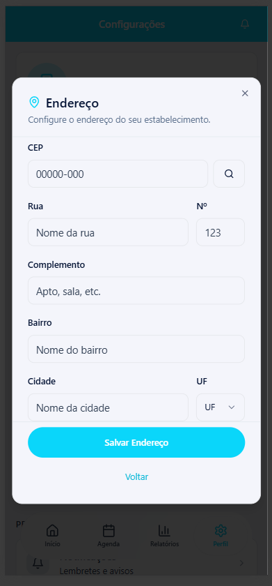

---

## 👥 4. Gestão de Funcionários / Equipe

Centraliza a listagem dos profissionais, limites do plano contratado e ações de cadastro.

### Modal Principal de Funcionários:
- **Título:** `Funcionários (X / Y do plano)` informando a cota disponível.
- **Card do Proprietário:** Destaque com tag `Dono`, cargo `Proprietário` e e-mail.
- **Lista de Colaboradores:** Cards clicáveis com avatar, nome e função/contato.
- **Botão "+ Adicionar colaborador":** Expande o formulário inline de novo profissional.

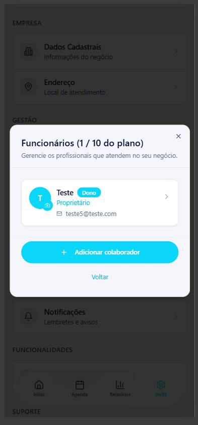

---

## ➕ 5. Cadastro de Novo Colaborador (Inline / Modal)

Formulário simplificado para admissão de novos profissionais na equipe.

### Campos e Fluxo:
1. **Nome completo\*** *(Obrigatório)*.
2. **E-mail\*** *(Obrigatório — utilizado para login e recebimento da senha temporária)*.
3. **Quais serviços este profissional realiza?** *(Acordeon expansível com lista de checkboxes dos serviços ativos do negócio, exibindo duração e valor)*.
   - *Nota:* Sem serviços vinculados, o profissional não fica visível para agendamento pelos clientes no portal público.
4. **Acesso à equipe (Toggle Switch):**
   - Ativa permissão para visualizar e agendar para outros colaboradores no painel.
5. **Aviso do Sistema:** Informa que o colaborador receberá um e-mail com senha temporária para primeiro acesso e troca de senha.
6. **Ações:** `Adicionar` (dispara `POST /staff` gerando usuário no Cognito + envio SES) e `Cancelar`.

| Formulário Fechado | Seleção de Serviços Expandida |
|---|---|
| 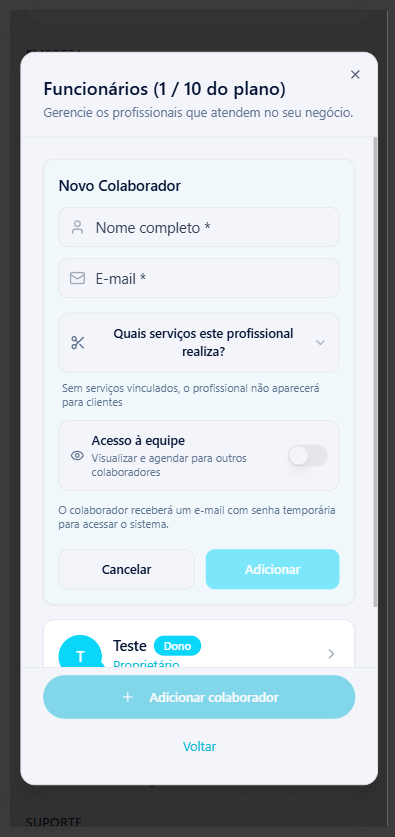 | 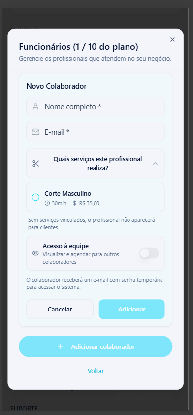 |

---

## 👤 6. Detalhes do Colaborador, Serviços & Disponibilidade

Ao clicar em um profissional na lista, abre o modal completo de gestão individual.

### Estrutura:
1. **Cabeçalho:** Botão `Voltar`, Avatar com opção de troca de foto, Nome, Tag de Dono/Função e E-mail.
2. **Seção Serviços Oferecidos:**
   - Lista todos os serviços cadastrados na barbearia com **Toggle Switch** individual para ativar/desativar cada serviço para aquele colaborador.
3. **Seção Disponibilidade:**
   - **Horário padrão do negócio:** Mostra os horários padrão configurados na empresa com link direto para edição.
   - **Ações de Bloqueio:**
     - 🕒 `Bloquear horário` (Bloqueio pontual com data e hora).
     - 🔁 `Bloqueio recorrente` (Bloqueio semanal em dias específicos).
     - 🌴 `Marcar férias` (Período estendido de ausência).
4. **Seção Bloqueios Ativos:**
   - Lista todos os bloqueios cadastrados agrupados por categoria (**Férias**, **Recorrentes**, **Pontuais**), com detalhes, motivo e botões para **Editar** e **Excluir** (Lixeira).

| Serviços & Horário Padrão | Ações de Bloqueio & Estado Vazio | Bloqueios Ativos Cadastrados |
|---|---|---|
| 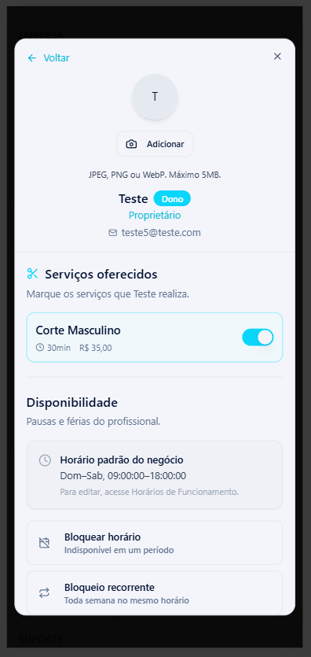 | 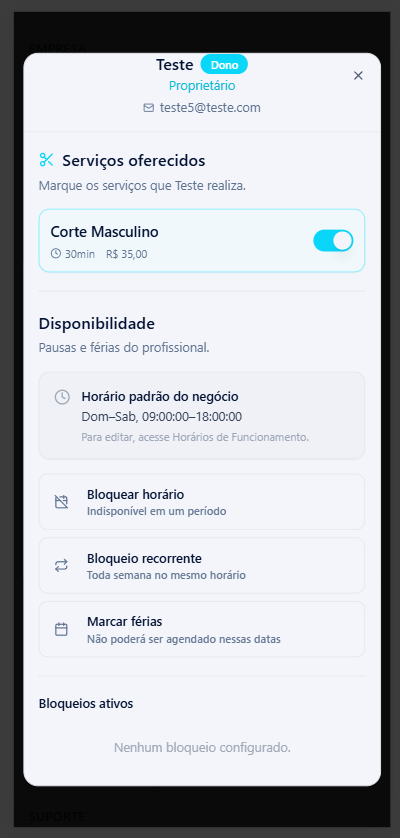 | 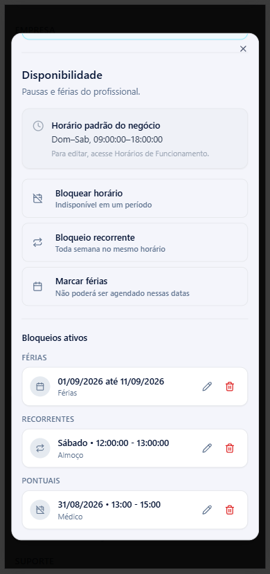 |

---

## 🚫 7. Modais de Bloqueio de Horário e Férias

### 7.1. Bloquear Horário (Pontual)
- **Objetivo:** Indisponibilizar o profissional em uma data e intervalo de tempo específicos (ex: consulta médica).
- **Campos:** `Data` (date picker), `Início` (time), `Fim` (time), `Motivo (opcional)`.
- **Ações:** `Salvar bloqueio` (`POST /availability-blocks` com tipo `ONE_TIME`) e `Cancelar`.

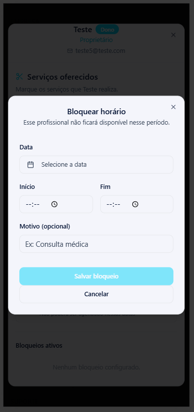

---

### 7.2. Bloqueio Recorrente (Semanal)
- **Objetivo:** Indisponibilizar o mesmo horário toda semana (ex: pausa de almoço às terças e quintas).
- **Campos:** `Dias da semana` (chips de seleção múltipla: *Dom, Seg, Ter, Qua, Qui, Sex, Sáb*), `Início` (time), `Fim` (time), `Motivo (opcional)`.
- **Ações:** `Salvar bloqueio` (`POST /availability-blocks` com tipo `RECURRING`) e `Cancelar`.

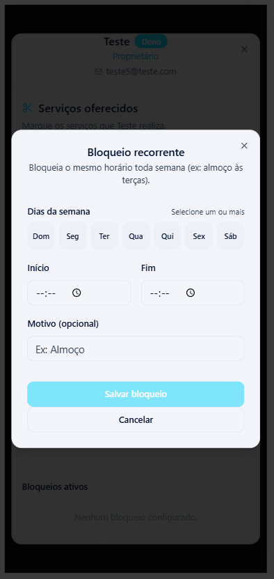

---

### 7.3. Marcar Férias (Período)
- **Objetivo:** Bloquear agendamentos em um intervalo de dias consecutivos.
- **Campos:** `Data de início` (date picker), `Data de término` (*Opcional: deixe vazio para férias de 1 dia*), `Motivo (opcional)`.
- **Ações:** `Salvar férias` (`POST /availability-blocks` com tipo `VACATION`) e `Cancelar`.

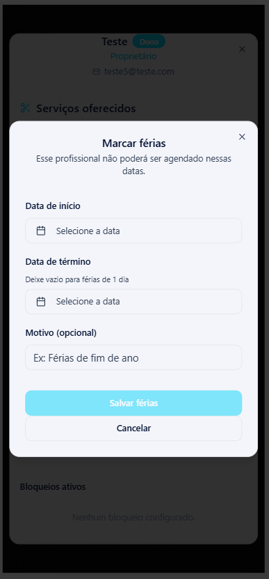