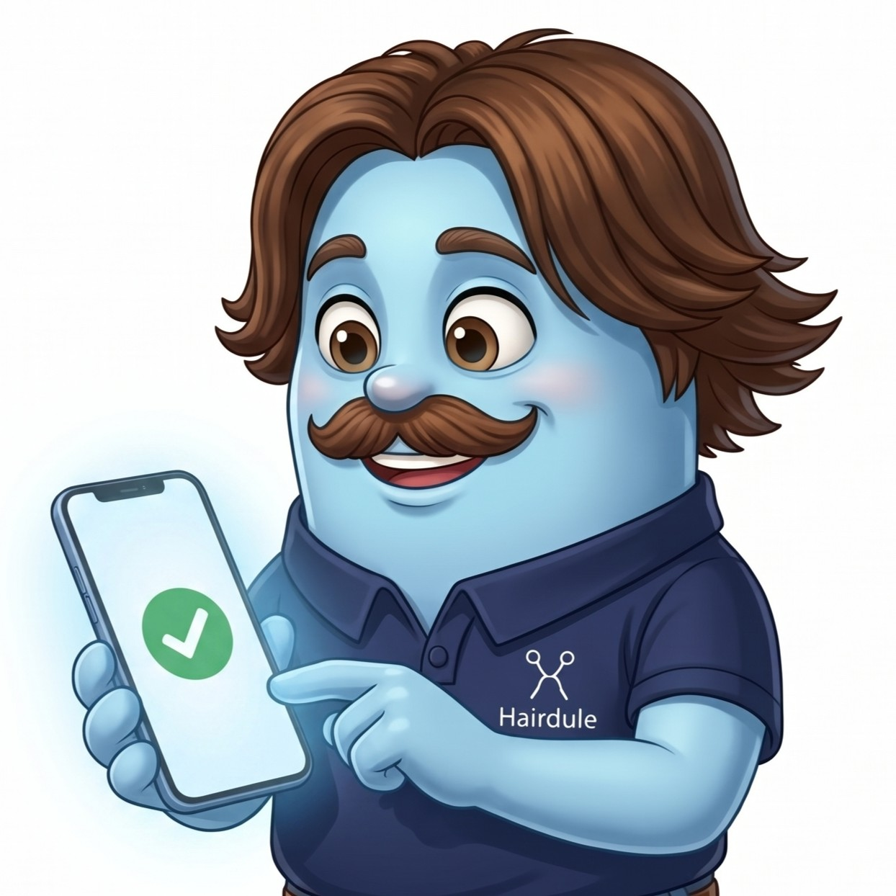
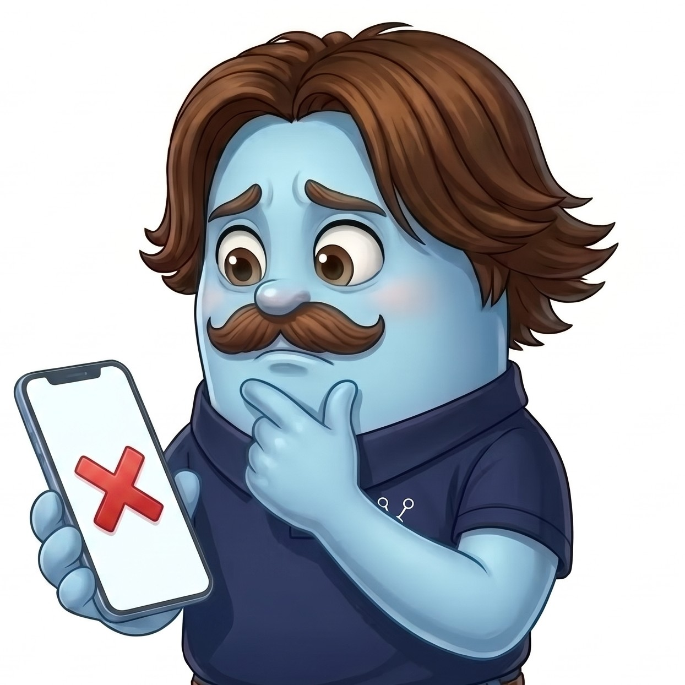
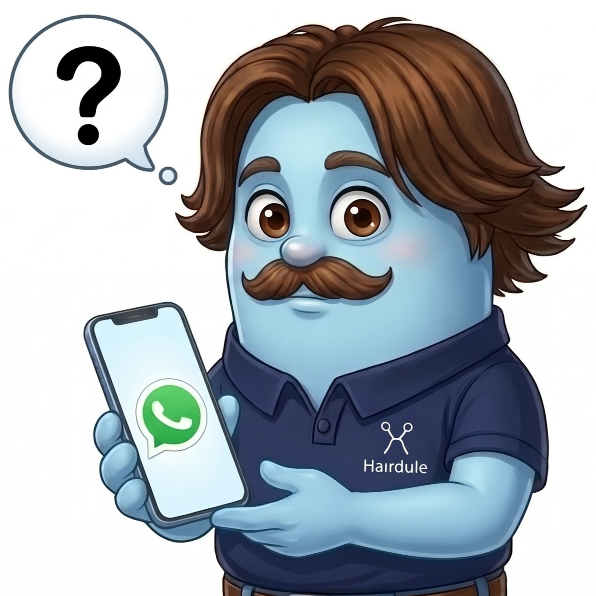
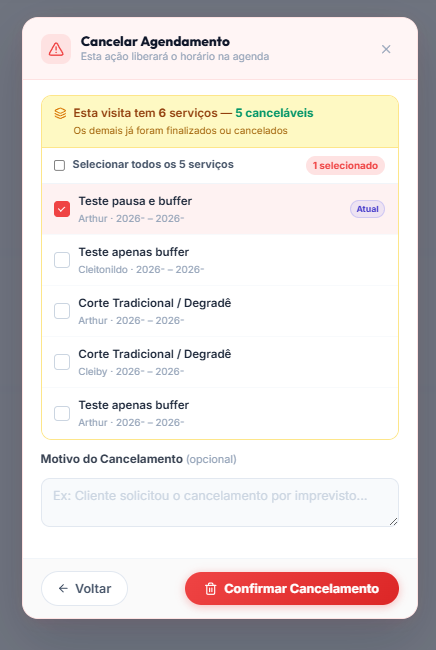

## 1 - Notificações do Hairy 

- Deve exibir as ultimas 3 mensagens lidas e todas não lidas

- Caso seja mensagem de cancelamento, seja por parte do cliente ou da equipe deve ser exibida em destaque na Lista em "/agenda". Aplique a data do agendamento para direcionar o osusuário e deixar o mais claro ao usuário.

Exemplo: 
Cliente tem um agendamento para dia 15/09, porém ele cancelou, ao clicar na notificação do Hairy ele deve ser redirecionado para a página de "/agenda", Lista e os filtros devem estar aplicados na data do agendamento para que apareça o cancelamento em destaque.

- Para agendamentos, nada muda.

- Notei que o Hairy não está aparecendo quando é redirecionado para o agendamento. Ele deve continuar aparecendo.

- Quero que o agendamento pare de piscar quando o usuário clicar.

## 3 -Mudança na confirmação final de agendamento, cancelamento, reagendamento, etc.

Quero que ao final das jornadas, em vez de ter um botão para efetivar o processo, quero um botão de arrastar, estilo "Swipe", para confirmar. Quero que o Swipe apensa no final.

Usar imagens do Hairy para cada situação:

## 4 - Perguntar ao usuário se deseja enviar WhatsApp ao final de todo agendmento, remarcação e cancelamento usando a imagem do Hairy

## 5 - Em disponibilidade ou em "Agenda", ao clicar em um horário, caso o usuário opte para adicionar mais um serviço, exibir horários disponiveis com a sugestão do hairy. Apenas o primeiro serviço que o horário deve ser preenchido e bloqueado.

## 6 - Reformule o modal de cancelmaneto para ficar mais elegante e claro ao usuário. 

Não está exibindo o horário do agendamento e data. Deixe em ordem cronológica e mais organizado.

Outro ponto é que se o usuário nõ tem permissão para agendar para os colegas ele não deveria ter a opção de cancelar os agendamentos dos colegas. Bloqueie essa opção no backend;

