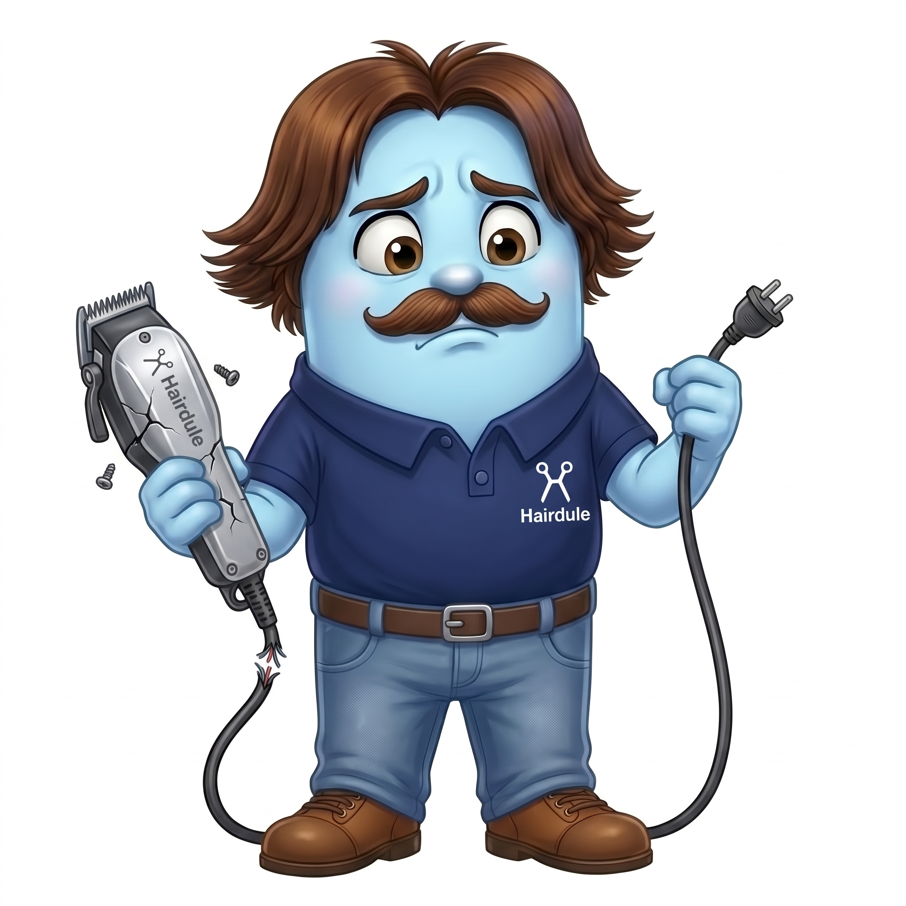
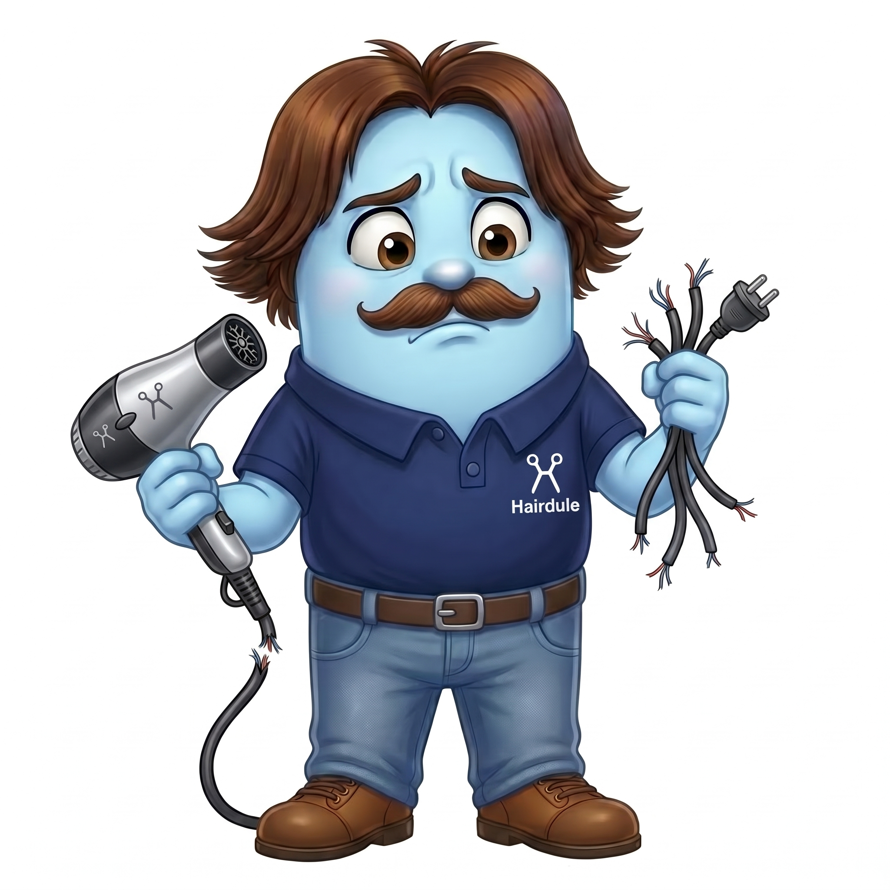

# Hairdule - pendências

## 1 - Troca de senha no primeiro acesso ao cadastrar em colaboradores.

Foi notado que ao cadastrar um novo colabordor pela página de funcionários, apesar dele receber a senha de acesso provisória, não é solicitado que ele faça a troca da mesma no primeiro acesso, como deveria ser feito. O processo deveria ser igual ao cadastrado pelo Onboarding.

## 2 - Trocar TODAS as notificações pelo Hairy
Todas as notificações de agendamento, erros de sistemae avisos deverão ser exibidos pelo Hairy.
Para erros de sistema, um modal deve surgir na tela: 
"Houve um erro ao cadastrar..."
"Não foi possível concluir..."
"Não foi possível atualizar..."
"Não foi possível apagar..."

### Icones de erros quando falhar alguma comunicação com o servidor:

Nas páginas "/meu-dia" e "/agenda", deve aparecer um botão flutuante com o icone do Hairy. Ao clicar nele, deve aparecer um modal com uma mensagem de saudação e informações do dia. Notificações de agendamentos próximos devem ser exibidas. Ex: "Você tem um agendamento em 10 minutos com Fulano".

A mensagem deve ser amigável e deve ter um tom de conversa. Tanto erros de sistema quanto notificações de agendamentos.

No push notification, deve ser exibido a imagem do Hairy ao lado da mensagem em vez do incone do app.

Ao clicar nas notificações de agendamento, redirecionar o usuário para a página "/agenda" na data do agendamento e destacar o agendamento na lista.

### Hairy ao ter alguma notificação:

### Hairy neutro, quando não há notificações:

## 3 - Agendamentos no passado.
Na página "/agenda" é possivel será possível cadastrar agendas no passado clicando em um espaço vazio da agenda. Porém deve exibir antes um aviso do Hairy modal de confirmação "Você está agendando um serviço no passado e a situação dele ficará como finalizado. Deseja continuar?"

### Hairy avisando:

