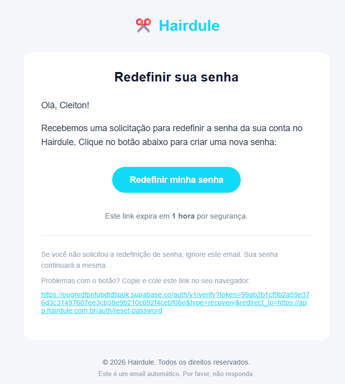
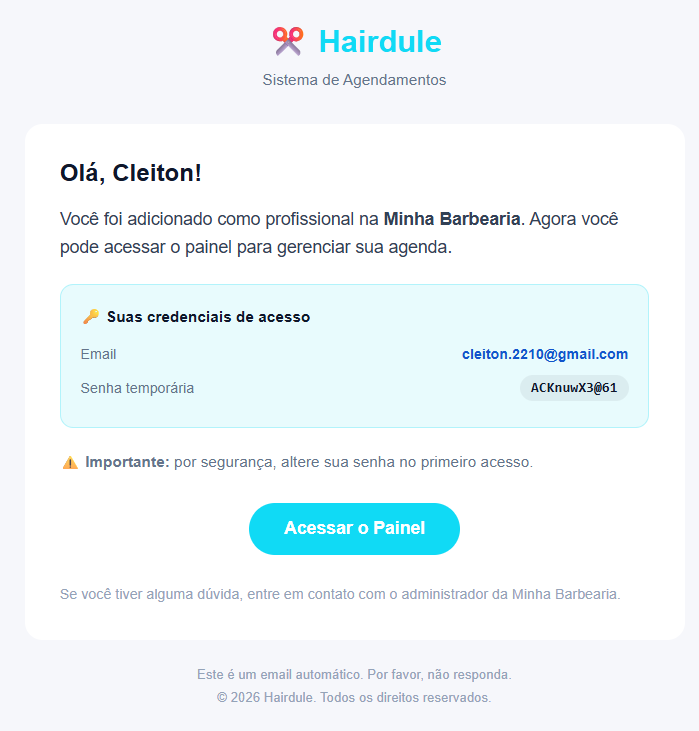
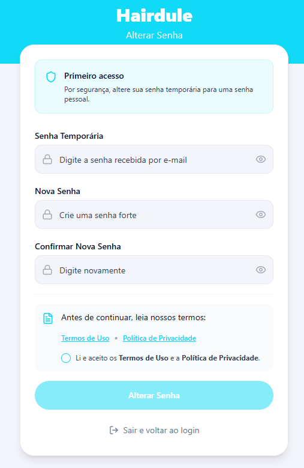

# Recuperar Senha

## Página de recuperar senha

## Página de criar sua nova senha

Valide os projetos e o plano de [implementação](<../../Planos de implementação/INDICE_MESTRE.md>). Caso não tenha sido criado um sistema de envio de email, crie um plano novo.

Hoje o Hairdule tem um dominio, hairdule.com.br, e pretendemos migrar para a AWS, inclusive no email.

Monte o plano em cima disso.

O email será usado em 2 momentos por enquanto:

- **1- Recuperação de senha.**
- **2- Cadastro de profissionais ao negócio, onde será enviado uma senha temporária**

Ao acessar com a senha temporária, redireciona para página de criar nova senha.

